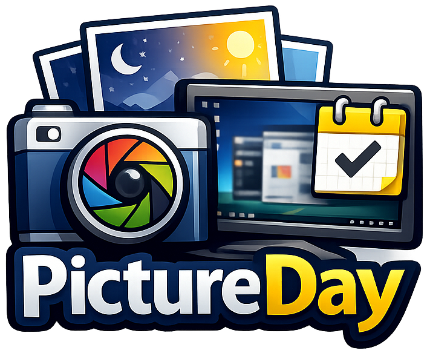

# PictureDay

A Windows desktop application that captures daily screenshots with privacy protection features. I made this because I've recently found some old pictures of my desktop from 4+ years ago and I thought it would be cool and interesting for anyone to be able to track how their computer changes over time.

## Overview

PictureDay takes a screenshot of your screen once per day at a scheduled time. It includes privacy filters to prevent screenshots when sensitive applications are running (or when you're... inspecting... stuff...), and provides a gallery to browse your captured screenshots organized by month.

## Screenshots


_Photo Gallery showing the statistics display, dynamic date range, and enhanced navigation controls in PictureDay v2.5.1. NOTE: Images are blurred for privacy._


_Settings menu with comprehensive configuration options including privacy filters, screenshot scheduling, monitor selection, quality settings, and storage management_


_Example screenshot captured by PictureDay, demonstrating the application's daily screenshot functionality. (Some portions of photo blurred for privacy)_

## Features

### Core Functionality

-   **Automatic Daily Screenshots**: Captures one screenshot per day at a configurable time
-   **Privacy Protection**: Blocks screenshots when blocked applications or private browsing modes are detected
-   **Activity Monitoring**: Only captures screenshots when the user is active
-   **Quarter Checkpoint System**: For TimeRange mode, takes photos at 4 quarter checkpoints plus the main scheduled time
-   **Intelligent Photo Selection**: Automatically selects the best photo for each day at midnight with priority: MAIN > quarter* > backup*
-   **Monthly Organization**: Screenshots are automatically organized into monthly folders

### Manual Controls

-   **Manual Screenshot Trigger**: Take screenshots on-demand via button, system tray menu, or keyboard shortcuts (F12 or Ctrl+S)
-   **System Tray Integration**: Runs in the background with system tray icon for quick access
-   **Auto-Updates**: Automatically checks for updates on startup; manual check available via system tray menu
-   **Donate Button**: Support the project via the Donate button in the top right corner of the main window

### Scheduling Options

-   **Random Time**: Automatically picks a random time from 0:00 to 23:59, ensuring the selected time hasn't passed yet
-   **Fixed Time**: Set a specific time for daily screenshots
-   **Time Range**: Random time within a custom range, with smart selection that respects current time
-   **Quarter Checkpoints**: For TimeRange mode, automatically creates 4 quarter checkpoints within the range to increase chances of capturing a photo

### Screenshot Settings

-   **Image Format**: Choose between JPEG or PNG
-   **Quality Control**: Adjustable JPEG quality (10-100)
-   **Desktop Only Mode**: When enabled, automatically minimizes all windows before capturing, showing only the desktop background
-   **Multi-Monitor Support**: Capture primary monitor, all monitors, or a specific monitor

### Gallery & Management

-   **Photo Gallery**: Browse screenshots organized by month and year
-   **Thumbnail View**: Quick preview of all screenshots
-   **Full-Screen Viewer**: Click any thumbnail to view full-size image with navigation arrows to browse through images
-   **Zoom Controls**: Zoom in/out with mouse wheel or +/- buttons, with zoom level display (10% to 1000%) and reset button
-   **Pan & Drag**: Click and drag to pan around zoomed images with intuitive hand cursor
-   **Smart Zooming**: Zoom centers on cursor position for precise navigation
-   **Context Menu**: Right-click any image for quick actions (Open, Open in File Explorer, Copy Image, Copy File Location, Delete)

## Requirements

-   Windows 10/11
-   .NET 8.0 Runtime
-   At least one monitor

## Installation

1. Download the latest release
2. Extract the files to your desired location
3. Run `PictureDay.exe`
4. The application will start minimized in the system tray

## Usage

### First Run

On first launch, PictureDay will:

-   Create a default screenshot directory in `Pictures\PictureDay`
-   Set up automatic daily screenshots with random scheduling
-   Add itself to Windows startup (optional)

### Taking Manual Screenshots

You can take screenshots manually using:

-   **Button**: Click "Take Screenshot Now" in the main window
-   **System Tray**: Right-click the system tray icon → "Take Screenshot Now"
-   **Keyboard**: Press `F12` or `Ctrl+S` when the main window is focused

### Viewing Screenshots

1. Open PictureDay from the system tray
2. Navigate to the "Photo Gallery" tab
3. Use the month/year dropdowns or arrow buttons to browse
4. Click any thumbnail to view the full-size image
5. Use the left/right arrow buttons in the image viewer to navigate between images
6. **Zoom Controls**: Use mouse wheel to zoom in/out (zooms toward cursor position), or use the +/- buttons with zoom level display. Click "Reset" to return to 100% zoom
7. **Pan & Drag**: When zoomed in, click and drag to pan around the image (cursor changes to hand when panning is available)
8. Right-click any image for context menu options (Open, Open in File Explorer, Copy Image, Copy File Location, Delete)
9. Click "Exit" button to close the image viewer

### Configuration

Access settings via:

-   Main window → "Settings" tab
-   System tray icon → "Settings"

#### Available Settings

**Privacy Filter**

-   Add applications to block list (screenshots won't be taken when these apps are running)
-   Automatically detects private browsing modes

**Screenshot Schedule**

-   Choose scheduling mode (Random, Fixed Time, or Time Range)
-   Configure time settings based on selected mode
-   View today's scheduled screenshot time (displays in 12-hour format, fully date-aware)
-   See notification if today's scheduled time has already passed (will schedule for tomorrow), using the same date+time logic as the scheduler and logs
-   **TimeRange Mode**: Automatically creates 4 quarter checkpoints within your selected range. Photos are taken at the main scheduled time and all quarter checkpoints during the day. At midnight, the system automatically selects the best photo (main photo if available, otherwise randomly selects from quarters)

**Monitor Selection**

-   Primary Monitor (default)
-   All Monitors (combined capture)
-   Specific Monitor (select from available monitors)

**Quality & Format**

-   Image format: JPEG or PNG
-   JPEG quality slider (10-100, only applies to JPEG)

**Storage**

-   Configure screenshot directory
-   Browse to select custom location

**Startup**

-   Enable/disable "Start with Windows"

## Privacy & Security

-   Screenshots are stored locally on your computer
-   Privacy filter prevents screenshots when sensitive applications are detected
-   No data is sent to external servers
-   All processing happens on your local machine

## File Organization

Screenshots are organized as follows:

```
ScreenshotDirectory/
  ├── 2024-01/
  │   ├── 2024-01-15_14-30-45.jpg
  │   ├── 2024-01-16_09-15-22.jpg
  │   └── ...
  ├── 2024-02/
  │   └── ...
  └── ...
```

## Configuration File

Settings are stored in:

```
%APPDATA%\PictureDay\config.json
```

## Keyboard Shortcuts

-   `F12` - Take screenshot now
-   `Ctrl+S` - Take screenshot now
-   `Ctrl+W` - Close window (minimizes to tray)

## Troubleshooting

### Screenshots Not Being Taken

1. Check that the application is running (look for system tray icon)
2. Verify your schedule settings in Settings
3. Ensure you're active (screenshots only capture when user is active)
4. Check if privacy filter is blocking (blocked apps or private browsing detected)

### Can't Find Screenshots

1. Check the screenshot directory in Settings
2. Verify the directory exists and is accessible
3. Check Windows file permissions

### Application Won't Start

1. Ensure .NET 8.0 Runtime is installed
2. Check Windows Event Viewer for error details
3. Run as administrator if permission issues occur

## Technical Details

-   **Framework**: .NET 8.0
-   **UI**: WPF (Windows Presentation Foundation)
-   **Image Format**: JPEG (default) or PNG
-   **Storage**: Local file system
-   **Architecture**: Service-based with dependency injection

## Development

### Building from Source

```bash
dotnet restore
dotnet build
dotnet run
```

### Building Release Package

To create a release package:

```bash
build-release.bat
```

This will:

-   Build the application as a self-contained release (includes .NET runtime)
-   Package everything into a ZIP file named `PictureDay-v[VERSION]-Release.zip`
-   Include README and LICENSE files
-   Include PictureDayUpdater.exe for auto-update functionality
-   Create a portable package that works on any Windows PC without requiring .NET installation

The ZIP file can be extracted and run on any Windows PC - Run `PictureDay.exe`

### Project Structure

```
PictureDay/
├── Models/          # Data models (AppConfig, ScreenshotMetadata)
├── Services/        # Core services (Screenshot, Storage, Scheduler, etc.)
├── Views/           # UI views (Settings, PhotoGallery)
├── Utils/           # Utility classes
└── App.xaml.cs      # Application entry point
```

## Changelog

See [CHANGELOG.md](CHANGELOG.md) for a detailed version history.

## License

See [LICENSE](LICENSE)

## Contributing

Any contributions are welcome! Please use best coding practices and clearly explain what you added in pull requests!

## Support

If you find a bug, please make an issue report and describe any steps necessary to re-create the issues, if possible. The more information you give, the better I can fix issues.
